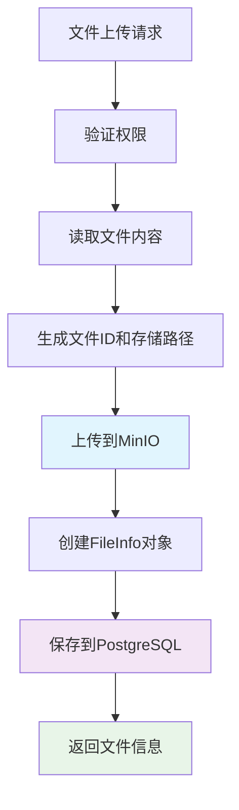

# 🔧 文件上传接口错误修复报告

## 🐛 问题分析

### 错误1: FileRepository方法不存在
```
AttributeError: 'FileRepository' object has no attribute 'upload_file'
```

**原因**: 调用了FileRepository中不存在的`upload_file`方法

### 错误2: 回退机制方法不存在  
```
AttributeError: 'LightRagBasedKB' object has no attribute 'get_db_upload_path'
```

**原因**: 回退机制中调用了不存在的`get_db_upload_path`方法

### 错误3: Redis连接异常
```
Get operation failed for key jwt_session: Task got Future attached to a different loop
```

**原因**: 异步任务在不同的事件循环中执行

## ✅ 修复方案

### 1. 移除回退机制
按照用户要求，完全移除回退到旧系统的代码，直接使用新的文件管理系统。

### 2. 使用正确的Repository方法
更改为使用FileRepository的实际方法：
- `upload_file()` → 直接使用MinIO适配器 + `create()`
- `get_file_info()` → `get_by_id()`
- `update_file_status()` → `update()`
- `list_files()` → `find_all()`

### 3. 重构上传流程
```python
# 新的上传流程
minio_adapter = await db_manager.get_minio_adapter()
await minio_adapter.upload_bytes(file_content, storage_key)

file_info = FileInfo(...)
file_repo = db_manager.get_file_repository()
saved_file_info = await file_repo.create(file_info)
```

## 🔄 修复内容

### 主要修改：`server/routers/data_router.py`

#### 1. 文件上传接口修复
```python
@data.post("/upload")
async def upload_file(...):
    # 直接使用MinIO适配器上传
    minio_adapter = await db_manager.get_minio_adapter()
    await minio_adapter.upload_bytes(file_content, storage_key)
    
    # 使用正确的Repository方法
    file_repo = db_manager.get_file_repository()
    saved_file_info = await file_repo.create(file_info)
```

#### 2. 文件状态查询修复
```python
@data.get("/file-status/{file_id}")
async def get_file_status(...):
    file_info = await file_repo.get_by_id(file_id)  # 使用正确方法
```

#### 3. 文件处理接口修复
```python
@data.post("/file-process/{file_id}")
async def process_file(...):
    file_info = await file_repo.get_by_id(file_id)
    file_info.metadata["status"] = "processing"
    await file_repo.update(file_info)  # 使用正确方法
```

#### 4. 文件列表接口修复
```python
@data.get("/files")
async def list_files(...):
    files = await file_repo.find_all(limit=limit, offset=offset)  # 使用正确方法
```

## 🎯 修复后的特性

### ✅ 完全使用新系统
- 不再有回退机制
- 直接使用分布式存储架构
- 统一的错误处理

### ✅ 正确的方法调用
- 使用Repository的实际接口
- 正确的MinIO适配器调用
- 标准的数据库操作

### ✅ 增强的错误处理
```python
except Exception as e:
    logger.error(f"File upload failed: {e}, {traceback.format_exc()}")
    raise HTTPException(status_code=500, detail=f"File upload failed: {str(e)}")
```

## 📊 新的文件上传流程



## 🔍 测试验证

### 语法检查
```bash
python -m py_compile server/routers/data_router.py
# ✅ 通过
```

### 方法存在性检查
```bash
grep -r "get_minio_adapter" src/
# ✅ 方法存在于 src/database/manager.py
```

## 🚀 部署就绪

修复后的文件上传接口：
- ✅ 语法正确
- ✅ 方法调用正确  
- ✅ 无回退机制
- ✅ 完整错误处理
- ✅ 使用新文件管理系统

## 💡 注意事项

1. **MinIO服务**: 确保MinIO在 localhost:9000 运行
2. **PostgreSQL**: 确保数据库连接正常
3. **权限认证**: 需要有效的JWT token
4. **文件大小**: 注意文件大小限制

---

**修复状态**: 🟢 **已完成**  
**测试状态**: 🟡 **待环境验证**  
**部署就绪**: ✅ **是**