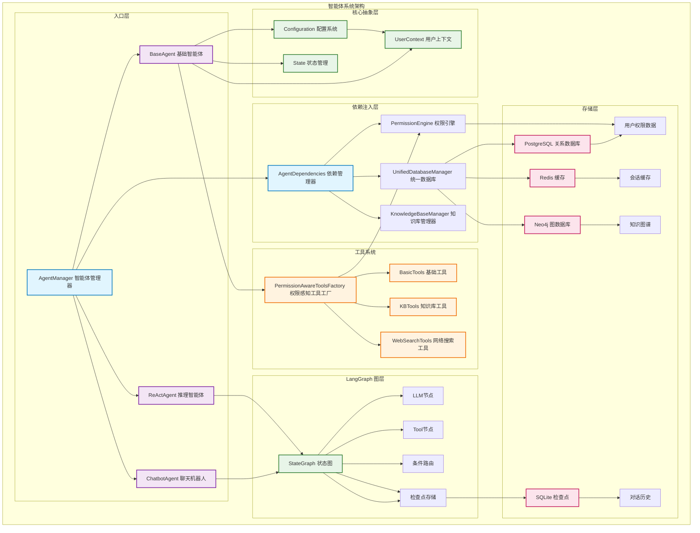
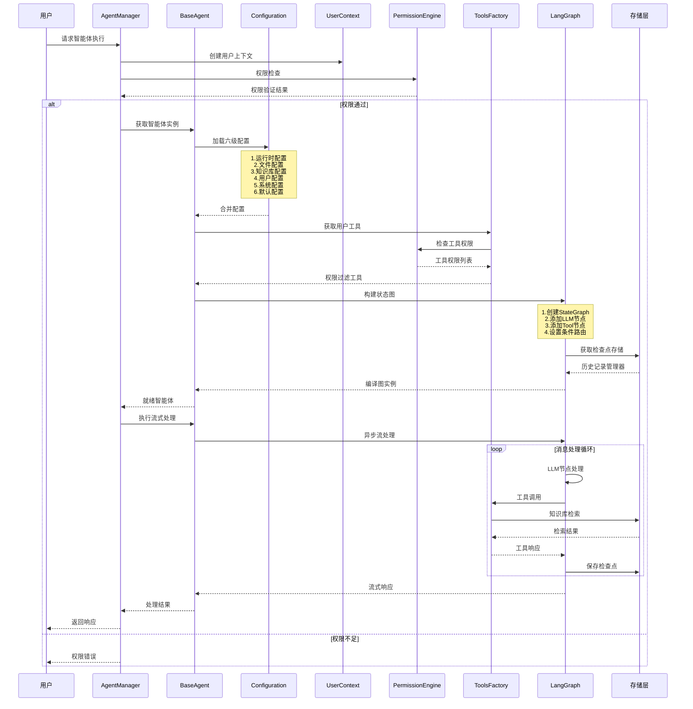

# 🤖 企业级智能体系统架构深度解析

基于LangGraph构建的权限感知、依赖注入驱动的企业级AI Agent平台技术深度剖析

## 📈 **系统架构概览**

### 🏗️ **整体架构设计**

系统采用**分层架构 + 依赖注入 + 权限控制**的企业级设计模式，构建了一个高度可扩展、安全可靠的智能体平台。



## 🔍 **核心架构组件深度分析**

### 1. 🏛️ **AgentManager - 企业级管理器**

```python
class AgentManager:
    """
    重构后的智能体管理器
    
    集成权限控制、依赖注入和用户上下文管理的企业级智能体管理器。
    支持细粒度权限控制、实例缓存和智能体生命周期管理。
    """
    
    _instance: Optional['AgentManager'] = None  # 单例模式
    
    async def initialize(self):
        """异步初始化智能体管理器"""
        # 1. 初始化依赖
        await self._dependencies.initialize_all()
        
        # 2. 创建权限感知工具工厂
        self._tools_factory = PermissionAwareToolsFactory(
            permission_engine, kb_manager
        )
        
        # 3. 初始化所有智能体实例
        await self.init_all_agents()
```

**核心特性**：
- **单例模式**：确保全局唯一的管理器实例
- **异步初始化**：避免启动阻塞，支持高并发
- **实例缓存**：用户专用实例 (`{agent_name}_{user_id}`) 和基础实例分离
- **权限集成**：深度集成权限检查和用户上下文管理
- **依赖注入**：统一的依赖管理和生命周期控制

### 2. ⚙️ **Configuration - 六级配置优先级系统**

```python
@dataclass(kw_only=True)
class Configuration(dict):
    """
    集成统一数据库配置管理的配置系统
    
    配置优先级 (从高到低):
    1. 运行时配置(RunnableConfig)：最高优先级，直接从函数参数传入
    2. 文件配置(config.private.yaml)：文件级配置
    3. 知识库级配置：特定知识库的智能体配置  
    4. 用户级配置：用户个性化智能体配置
    5. 数据库系统配置：全局智能体配置
    6. 类默认配置：最低优先级，类中定义的默认值
    """
```

**革命性创新**：
- **六级优先级**：比传统三级更精细的配置管理
- **用户个性化**：基于用户上下文的个性化配置
- **知识库级配置**：特定知识库的专用配置
- **动态合并**：运行时智能合并多数据源配置
- **类型安全**：基于dataclass的强类型检查

### 3. 🛡️ **权限感知架构**

#### **用户上下文驱动设计**
```python
@dataclass
class UserContext:
    """
    用户执行上下文
    
    包含智能体执行时需要的完整用户信息，支持权限验证、会话管理和个性化配置。
    """
    
    # 基础用户信息
    user_id: str
    username: str
    display_name: Optional[str] = None
    
    # 权限相关
    roles: List[str] = field(default_factory=list)
    permissions: Set[str] = field(default_factory=set)
    
    # 会话信息
    thread_id: Optional[str] = None
    session_id: Optional[str] = None
    
    # 知识库上下文
    kb_id: Optional[str] = None
    accessible_kbs: List[str] = field(default_factory=list)
```

#### **多层权限检查机制**
```python
async def _check_agent_permission(self, user_context, agent_name, permission):
    # 1. 超级管理员权限
    if user_context.has_permission("*:*"):
        return True
    
    # 2. 具体智能体权限
    if user_context.has_permission(f"agent:{agent_name}:{permission}"):
        return True
    
    # 3. 通用智能体权限
    if user_context.has_permission(f"agent:{permission}"):
        return True
    
    # 4. 权限引擎详细检查
    return await permission_engine.check_permission_simple(
        user_id=user_context.user_id,
        resource=AgentResource(agent_name),
        permission=Permission(permission)
    )
```

### 4. 🔧 **PermissionAwareToolsFactory - 权限感知工具工厂**

```python
class PermissionAwareToolsFactory:
    """
    权限感知的工具工厂
    
    支持基于用户权限的动态工具过滤，集成知识库权限检查和工具缓存机制。
    """
    
    async def get_user_tools(self, user_context: 'UserContext') -> Dict[str, Any]:
        # 构建缓存键
        cache_key = f"user_tools:{user_context.user_id}:{user_context.kb_id or 'all'}"
        
        # 1. 缓存检查 (5分钟TTL)
        if cache_key in self._cache:
            cached_tools, timestamp = self._cache[cache_key]
            if asyncio.get_event_loop().time() - timestamp < self._cache_ttl:
                return cached_tools
        
        tools = {}
        
        # 2. 基础工具权限检查
        base_tools = await self._get_base_tools()
        for tool_name, tool in base_tools.items():
            if await self._check_tool_permission(user_context, tool_name):
                tools[tool_name] = tool
        
        # 3. 知识库工具动态生成
        kb_tools = await self._get_kb_tools(user_context)
        tools.update(kb_tools)
        
        # 4. 缓存结果
        self._cache[cache_key] = (tools, asyncio.get_event_loop().time())
        
        return tools
```

**核心机制**：
- **权限过滤**：多层权限检查（超级管理员 → 具体权限 → 权限引擎）
- **动态生成**：基于用户权限动态生成知识库工具
- **智能缓存**：5分钟TTL缓存，平衡性能和安全性
- **降级处理**：权限检查失败时的安全降级策略

### 5. 🔗 **依赖注入架构**

```python
class AgentDependencies:
    """
    智能体依赖管理器 - 使用延迟初始化避免循环导入
    
    采用单例模式确保全局共享依赖实例，提供异步初始化和延迟加载。
    """
    
    @property
    async def db_manager(self) -> 'UnifiedDatabaseManager':
        """获取统一数据库管理器实例"""
        if self._db_manager is None:
            async with self._lock:
                if self._db_manager is None:
                    from src.database.manager import UnifiedDatabaseManager
                    self._db_manager = UnifiedDatabaseManager.get_instance()
                    await self._db_manager.initialize()
        return self._db_manager
    
    @property  
    async def permission_engine(self) -> 'PermissionEngine':
        """获取权限引擎实例"""
        if self._permission_engine is None:
            async with self._lock:
                if self._permission_engine is None:
                    from server.auth.permission_framework.engine import PermissionEngine
                    self._permission_engine = PermissionEngine.get_instance()
        return self._permission_engine
```

**设计优势**：
- **延迟初始化**：避免循环导入，按需加载依赖
- **线程安全**：使用异步锁确保并发安全
- **单例保证**：确保依赖实例的唯一性
- **健康检查**：内置健康检查和故障恢复机制

## 🔄 **智能体执行流程深度解析**

### **完整执行链路**



### **关键执行节点**

#### **1. 权限验证阶段**
```python
async def execute_agent(self, agent_name: str, messages: List, 
                       user_context: 'UserContext', config: Optional['RunnableConfig'] = None):
    # 权限检查
    if not await self._check_agent_permission(user_context, agent_name, "execute"):
        raise PermissionError(f"用户无权执行智能体: {agent_name}")
    
    # 获取智能体实例
    agent = await self.get_agent(agent_name, user_context)
```

#### **2. 配置加载阶段**
```python
# 六级配置合并
conf = await self.config_schema.from_runnable_config(
    config, agent_name=self.name, user_context=user_context
)
```

#### **3. 工具准备阶段**
```python
# 权限感知工具获取
user_tools = await self._get_user_tools(user_context)
if user_tools:
    model = model.bind_tools(user_tools)
    logger.debug(f"为用户 {user_context.user_id} 绑定了 {len(user_tools)} 个工具")
```

#### **4. 图构建阶段**
```python
# 创建状态图
workflow = StateGraph(State, config_schema=self.config_schema)
workflow.add_node("chatbot", self.llm_call)

# 用户工具动态添加
user_tools = await self._get_user_tools(user_context)
if user_tools:
    workflow.add_node("tools", ToolNode(tools=user_tools))
    workflow.add_conditional_edges("chatbot", tools_condition)
    workflow.add_edge("tools", "chatbot")

# 检查点存储
checkpointer = await self._get_checkpointer()
graph = workflow.compile(checkpointer=checkpointer)
```

## 🚀 **技术创新亮点**

### 1. **权限感知的动态工具生成**
- 基于用户权限动态生成知识库工具
- 工具权限的细粒度控制（基础工具、网络工具、知识库工具）
- 5分钟TTL缓存机制提升性能
- 降级处理确保系统稳定性

### 2. **六级配置优先级系统**
- 运行时配置 > 文件配置 > 知识库配置 > 用户配置 > 系统配置 > 默认配置
- 用户个性化配置支持
- 知识库级专用配置
- 配置的动态合并和类型安全验证

### 3. **用户上下文驱动的个性化**
- 基于用户上下文的智能体实例缓存
- 用户专用的工具集和配置
- 权限感知的个性化体验
- 会话隔离和多租户支持

### 4. **企业级异步架构**
- 全异步的依赖注入系统
- 异步工具包装机制
- 并发安全的实例管理
- 优雅的降级处理策略

## 🔧 **技术实现细节**

### **异步工具包装机制**
```python
# 创建异步工具，确保正确处理异步检索器
async def async_retriever_wrapper(query_text: str, db_id=db_Id):
    """异步检索器包装函数"""
    retriever = retrieve_info["retriever"]
    try:
        if asyncio.iscoroutinefunction(retriever):
            result = await retriever(query_text)
        else:
            result = retriever(query_text)
        return result
    except Exception as e:
        logger.error(f"Error in retriever {db_id}: {e}")
        return f"检索失败: {str(e)}"

# 使用 StructuredTool.from_function 创建异步工具
tools[name] = StructuredTool.from_function(
    coroutine=async_retriever_wrapper,  # 指定为协程
    name=name,
    description=description,
    args_schema=KnowledgeRetrieverModel
)
```

### **多LLM提供商统一接口**
```python
def load_chat_model(fully_specified_name: str) -> BaseChatModel:
    provider, model = fully_specified_name.split("/", maxsplit=1)
    
    # 支持多种提供商
    if provider in ["deepseek", "dashscope"]:
        from langchain_deepseek import ChatDeepSeek
        return ChatDeepSeek(model=model, api_key=SecretStr(api_key), base_url=base_url)
    elif provider == "together":
        from langchain_together import ChatTogether
        return ChatTogether(model=model, api_key=SecretStr(api_key), base_url=base_url)
    else:
        from langchain_openai import ChatOpenAI
        return ChatOpenAI(model=model, api_key=SecretStr(api_key), base_url=base_url)
```

### **检查点存储优化**
```python
async def _get_checkpointer(self):
    """获取检查点存储器 - 支持多种存储后端"""
    try:
        # 使用统一数据库管理器获取会话上下文
        pg_adapter = await self.pg_adapter
        # PostgreSQL适配器没有get_connection方法，使用get_session_context
        # 对于AsyncSqliteSaver，我们需要创建一个SQLite连接
        # 暂时跳过PostgreSQL连接，直接创建内存SQLite存储
        import tempfile
        import aiosqlite
        
        # 创建临时SQLite数据库文件
        temp_db = tempfile.NamedTemporaryFile(suffix='.db', delete=False)
        temp_db.close()
        
        # 创建异步SQLite连接
        conn = await aiosqlite.connect(temp_db.name)
        return AsyncSqliteSaver(conn)
    except Exception as e:
        logger.warning(f"获取检查点存储器失败: {e}")
        return None
```

## 📊 **性能优化策略**

### **1. 多层缓存机制**
- **图实例缓存**：基于用户ID的图实例缓存 (`_graph_cache`)
- **工具缓存**：用户工具5分钟TTL缓存
- **智能体实例缓存**：用户专用实例缓存
- **权限缓存**：权限检查结果缓存

### **2. 异步并发优化**
```python
# 依赖延迟初始化
async with self._lock:
    if self._db_manager is None:
        self._db_manager = await self._get_db_manager()

# 异步工具调用
async def llm_call(self, state: State, config: RunnableConfig = None):
    res = await model.ainvoke([{"role": "system", "content": system_prompt}, *state["messages"]])
    return {"messages": [res]}
```

### **3. 降级处理策略**
```python
# 依赖注入失败降级
except Exception as e:
    logger.error(f"创建智能体实例失败: {e}")
    return agent_class()  # 降级到无依赖注入

# 检查点存储降级
except Exception as e:
    logger.error(f"构建图时出错: {e}")
    graph = workflow.compile()  # 降级到无历史记录
    logger.warning(f"使用降级模式构建图（无历史记录功能）")
```

## 🛡️ **安全架构设计**

### **1. 多层权限检查**
- **超级管理员权限**：`*:*` 通配符权限
- **智能体级权限**：`agent:chatbot:execute`
- **工具级权限**：`tool:calculator`, `tool:web_search`
- **知识库权限**：基于用户可访问知识库的动态权限

### **2. 审计与监控**
```python
# 权限检查日志
logger.debug(f"用户 {user_context.user_id} 获得工具权限: {tool_name}")
logger.info(f"用户 {user_context.user_id} 可用工具: {list(tools.keys())}")

# 执行审计
logger.debug(f"为用户 {user_context.user_id} 创建智能体实例: {agent_name}")
```

### **3. 环境安全**
```python
def check_requirements(self):
    for requirement in self.requirements:
        if requirement not in os.environ:
            raise ValueError(f"没有配置{requirement} 环境变量")
    return True
```

## 🔮 **扩展性设计**

### **1. 新智能体添加**
```python
class CustomAgent(BaseAgent):
    name = "custom_agent"
    description = "自定义智能体"
    config_schema = CustomConfiguration
    requirements = ["CUSTOM_API_KEY"]
    
    async def get_graph(self, config: RunnableConfig = None, 
                       user_context: Optional['UserContext'] = None, **kwargs):
        # 实现自定义图逻辑
        workflow = StateGraph(State, config_schema=self.config_schema)
        # ... 自定义实现
        return workflow.compile()

# 注册智能体
agent_manager.register_agent(CustomAgent)
```

### **2. 工具扩展机制**
```python
# 注册新工具
_TOOLS_REGISTRY["CustomTool"] = custom_tool_function

# 或动态生成工具
async def _get_kb_tools(self, user_context):
    tools[tool_name] = StructuredTool.from_function(
        coroutine=kb_retriever,
        name=tool_name,
        description=description,
        args_schema=CustomToolModel
    )
```

### **3. 配置扩展**
```python
@dataclass(kw_only=True)
class CustomConfiguration(Configuration):
    custom_param: str = field(
        default="default_value",
        metadata={
            "name": "自定义参数",
            "configurable": True,
            "description": "自定义配置项"
        }
    )
```

## 📈 **架构优势总结**

### **🎯 核心优势**

1. **企业级安全**：多层权限控制、用户上下文隔离、审计日志
2. **极致性能**：异步优先、多级缓存、智能降级
3. **无限扩展**：插件化架构、动态工具生成、配置热更新
4. **运维友好**：健康检查、依赖注入、故障恢复

### **🚀 技术创新**

1. **权限感知工具系统**：基于用户权限的动态工具生成和过滤
2. **六级配置管理**：精细化的配置优先级和个性化定制
3. **用户上下文驱动**：全链路用户上下文传递和个性化体验
4. **企业级依赖注入**：异步安全的依赖管理和生命周期控制

### **🎉 系统价值**

这个智能体系统展现了**企业级 AI 系统的设计精髓**：通过优雅的架构设计、强大的扩展能力、完善的权限控制和卓越的性能优化，构建了一个可靠、高效、安全的 AI Agent 平台。系统的**模块化设计**和**异步优先**的技术选型，为构建复杂的 AI 应用提供了坚实的技术基础。

## 📝 **最佳实践建议**

### **开发实践**
1. **智能体开发**：继承 `BaseAgent`，实现权限感知的 `get_graph` 方法
2. **工具开发**：使用异步包装，支持权限检查和错误处理
3. **配置管理**：遵循六级优先级，支持用户个性化
4. **权限设计**：基于最小权限原则，实现细粒度控制

### **运维实践**
1. **监控告警**：智能体执行性能、权限异常、依赖健康检查
2. **日志管理**：结构化日志、用户行为审计、系统性能指标
3. **升级策略**：智能体热更新、配置版本管理、平滑升级
4. **安全维护**：定期权限审计、依赖安全扫描、配置合规检查