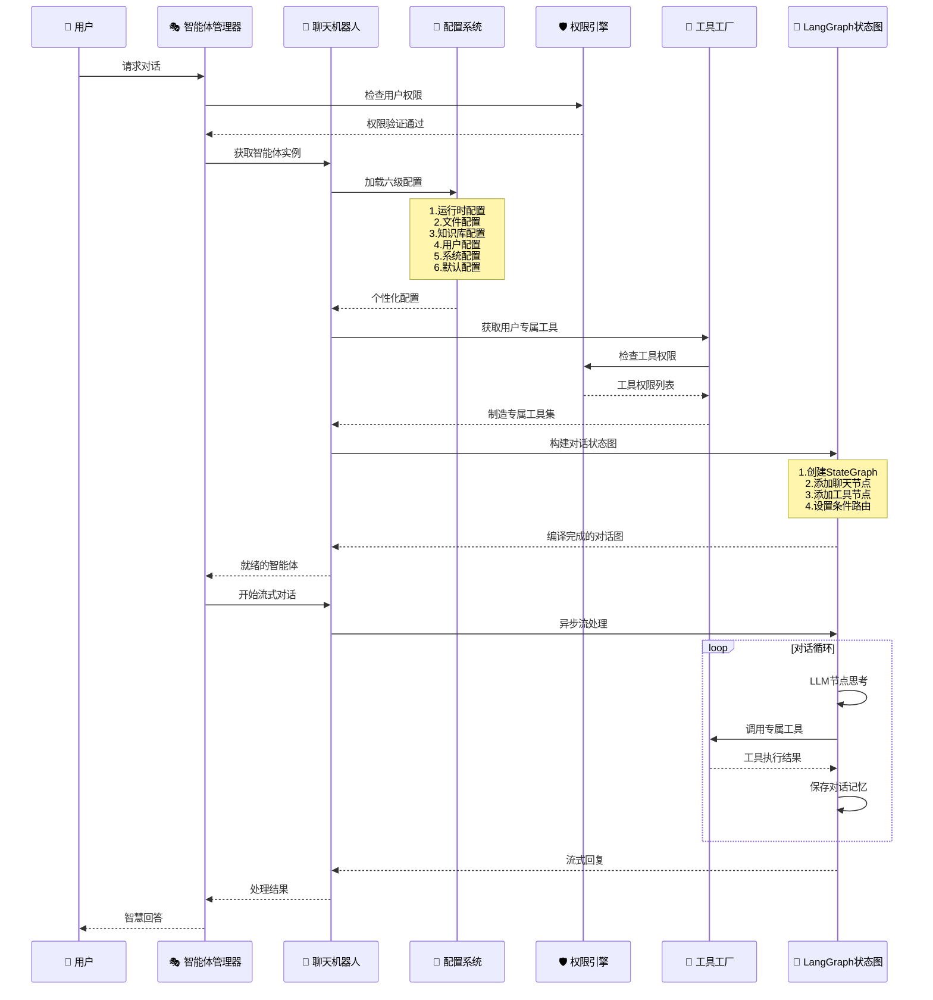
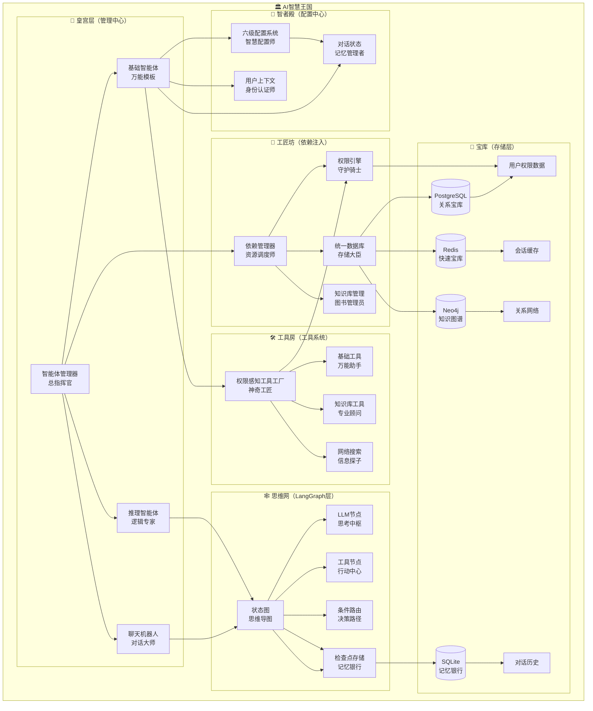

# 🤖 智能体系统：一部企业级AI的史诗巨作

> *"代码结构即大纲，模型即任务，方法即人为功能，逻辑即人物之间技能的排列"*

## 📚 **故事大纲（代码结构）**

### 第一章：智能体管理器 - 总导演
```python
# 【总导演】AgentManager：统筹全局的智慧指挥官
class 智能体管理器:
    """
    故事主线：一个强大的指挥官统筹着整个AI王国
    
    角色特质：
    - 单例模式：全国只有一个最高指挥官
    - 权限管控：严格审查每个人的访问权限
    - 实例缓存：为不同用户分配专属助手
    - 生命周期管理：从诞生到退场，全程掌控
    """
    
    def __init__(self):
        # 【设定】建立王国的基础设施
        self.智能体注册表 = {}      # 记录所有可用的智能体类型
        self.活跃实例库 = {}        # 存储正在工作的智能体
        self.依赖注入器 = None      # 获取各种必需的资源
        self.工具工厂 = None        # 制造各种工具的工厂
        self.初始化状态 = False     # 是否已完成王国建设
    
    async def initialize(self):
        """【起始剧情】建立AI王国的壮举"""
        # 第一步：初始化所有依赖关系
        await self.依赖注入器.初始化全部系统()
        
        # 第二步：建立权限感知工具工厂
        权限引擎 = await self.依赖注入器.权限引擎
        知识库管理器 = await self.依赖注入器.知识库管理器
        self.工具工厂 = 权限感知工具工厂(权限引擎, 知识库管理器)
        
        # 第三步：召唤所有智能体
        await self.初始化全部智能体()
        
        self.初始化状态 = True
        print("🎉 AI王国建设完成！")
    
    async def get_agent(self, 智能体名称: str, 用户上下文: 用户身份 = None):
        """【核心剧情】为用户分配专属智能体助手"""
        
        # 权限验证：检查用户是否有资格使用此智能体
        if 用户上下文 and not await self._检查智能体权限(用户上下文, 智能体名称, "访问"):
            raise PermissionError(f"用户无权访问智能体: {智能体名称}")
        
        # 为特定用户创建专属实例
        if 用户上下文:
            实例键 = f"{智能体名称}_{用户上下文.用户ID}"
            if 实例键 not in self.活跃实例库:
                智能体类 = self.智能体注册表[智能体名称]
                self.活跃实例库[实例键] = await self._创建智能体实例(智能体类)
            return self.活跃实例库[实例键]
        
        # 返回通用实例
        return self.活跃实例库[智能体名称]
```

### 第二章：基础智能体 - 万能模板
```python
# 【角色原型】BaseAgent：所有智能体的祖先模板
class 基础智能体(抽象基类):
    """
    故事设定：每个智能体都继承自这个万能模板
    
    核心属性：
    - 名称：智能体的身份标识
    - 描述：智能体的能力说明
    - 配置模式：个性化设置的蓝图
    - 环境要求：运行所需的外部条件
    """
    
    名称 = "基础智能体"
    描述 = "所有智能体的共同祖先"
    配置模式 = 基础配置
    环境要求 = []
    
    def __init__(self, 数据库管理器=None, 权限引擎=None, 知识库管理器=None):
        """【诞生仪式】智能体的初始化过程"""
        
        # 依赖注入：获取必要的系统组件
        self.依赖管理器 = 获取智能体依赖()
        self.数据库管理器 = 数据库管理器
        self.权限引擎 = 权限引擎
        self.知识库管理器 = 知识库管理器
        
        # 数据库适配器（延迟获取）
        self.PostgreSQL适配器 = None
        self.Redis适配器 = None
        self.Neo4j适配器 = None
        
        # 基础设施建设
        self.检查环境要求()
        self.工作目录 = self.创建工作目录()
        self.图实例 = None  # LangGraph状态图缓存
    
    async def check_user_permission(self, 用户上下文, 权限类型: str) -> bool:
        """【权限检查】验证用户是否有权使用此智能体"""
        try:
            权限引擎 = await self.权限引擎
            result = await 权限引擎.检查权限简单版(
                用户ID=用户上下文.用户ID,
                资源=智能体资源(self.名称),
                权限=权限对象(权限类型)
            )
            return result
        except Exception as e:
            print(f"权限检查失败: {e}")
            return False
    
    async def stream_values(self, 消息列表, 运行配置=None, 用户上下文=None):
        """【流式处理】像流水一样连续输出结果"""
        
        # 权限检查
        if 用户上下文 and not await self.check_user_permission(用户上下文, "执行"):
            raise PermissionError(f"用户无权执行智能体: {self.名称}")
        
        # 获取状态图实例
        状态图 = await self.get_graph(config=运行配置, user_context=用户上下文)
        
        # 确保配置中包含用户上下文
        if 运行配置 is None:
            运行配置 = {}
        if 用户上下文:
            运行配置["configurable"]["user_context"] = 用户上下文
        
        # 开始流式处理
        async for 事件 in 状态图.异步流处理({"messages": 消息列表}, stream_mode="values", config=运行配置):
            yield 事件["messages"]
```

### 第三章：聊天机器人智能体 - 对话大师
```python
# 【主角】ChatbotAgent：善于对话的智慧使者
class 聊天机器人智能体(基础智能体):
    """
    角色设定：专精对话艺术的智能体
    
    特殊技能：
    - 多轮对话：记住之前说过的话
    - 工具调用：能使用各种外部工具
    - 个性化配置：根据用户喜好调整行为
    - 权限感知：知道什么能做什么不能做
    """
    
    名称 = "聊天机器人"
    描述 = "权限感知的对话大师，支持多轮对话、工具调用和个性化配置"
    环境要求 = ["TAVILY_API_KEY", "ZHIPUAI_API_KEY"]
    配置模式 = 聊天机器人配置
    
    async def get_graph(self, config=None, user_context=None):
        """【核心技能】构建对话状态图"""
        
        # 获取个性化配置
        配置 = await self.配置模式.从运行配置获取(
            config, agent_name=self.名称, user_context=user_context
        )
        
        # 创建状态图
        工作流 = StateGraph(对话状态, config_schema=self.配置模式)
        
        # 添加核心节点
        工作流.add_node("聊天机器人", self.llm_call)
        工作流.set_entry_point("聊天机器人")
        
        # 获取用户可用工具
        用户工具 = await self._获取用户工具(user_context)
        if 用户工具:
            工具节点 = ToolNode(tools=用户工具)
            工作流.add_node("工具", 工具节点)
            工作流.add_conditional_edges("聊天机器人", tools_condition)
            工作流.add_edge("工具", "聊天机器人")
        else:
            工作流.set_finish_point("聊天机器人")
        
        # 获取检查点存储器（记忆系统）
        检查点存储器 = await self._获取检查点存储器()
        return 工作流.compile(checkpointer=检查点存储器)
    
    async def llm_call(self, 状态, config=None):
        """【对话技能】与大语言模型进行智慧对话"""
        
        # 获取用户上下文
        用户上下文 = config.get("configurable", {}).get("user_context") if config else None
        
        # 权限检查
        if 用户上下文 and not await self.check_user_permission(用户上下文, "执行"):
            raise PermissionError(f"用户无权执行智能体: {self.名称}")
        
        # 获取个性化配置
        配置 = await self.配置模式.从运行配置获取(
            config, agent_name=self.名称, user_context=用户上下文
        )
        
        # 构建系统提示词
        系统提示 = f"{配置.系统提示词} 当前时间: {获取当前时间()}"
        
        # 加载语言模型
        模型 = 加载聊天模型(配置.模型)
        
        # 绑定用户可用工具
        用户工具 = await self._获取用户工具(用户上下文)
        if 用户工具:
            模型 = 模型.bind_tools(用户工具)
        
        # 进行对话
        try:
            响应 = await 模型.异步调用([
                {"role": "system", "content": 系统提示},
                *状态["messages"]
            ])
            return {"messages": [响应]}
        except Exception as e:
            错误消息 = f"抱歉，处理您的请求时出现了错误: {str(e)}"
            return {"messages": [AI消息(content=错误消息)]}
```

## 🎭 **角色设定（主要组件）**

### 【智者】用户上下文 - 身份认证师
```python
@dataclass
class 用户身份:
    """
    角色背景：记录每个用户的完整身份信息
    
    身份档案：
    - 基础信息：用户ID、用户名、显示名称
    - 权限信息：角色列表、权限集合
    - 会话信息：线程ID、会话ID
    - 知识库上下文：当前知识库、可访问的知识库列表
    - 个人偏好：用户的个性化设置
    """
    
    # 基础身份信息
    用户ID: str
    用户名: str
    显示名称: Optional[str] = None
    
    # 权限相关
    角色列表: List[str] = field(default_factory=list)
    权限集合: Set[str] = field(default_factory=set)
    
    # 会话信息
    线程ID: Optional[str] = None
    会话ID: Optional[str] = None
    
    # 知识库上下文
    当前知识库ID: Optional[str] = None
    可访问知识库: List[str] = field(default_factory=list)
    
    # 个人设置
    用户偏好: Dict[str, Any] = field(default_factory=dict)
    
    def has_permission(self, 权限字符串: str) -> bool:
        """【技能】检查是否拥有特定权限"""
        return 权限字符串 in self.权限集合 or "*:*" in self.权限集合
    
    @classmethod
    async def 从用户对象创建(cls, 用户对象, 线程ID=None, 知识库ID=None):
        """【创建仪式】从数据库用户对象创建上下文"""
        
        # 获取用户权限
        权限列表 = await cls._获取用户权限(用户对象.id)
        
        # 获取用户角色
        角色列表 = []
        if hasattr(用户对象, 'roles') and 用户对象.roles:
            角色列表 = [角色.name for 角色 in 用户对象.roles]
        
        # 获取可访问的知识库
        可访问知识库 = await cls._获取可访问知识库(用户对象.id)
        
        return cls(
            用户ID=用户对象.id,
            用户名=用户对象.username,
            显示名称=getattr(用户对象, 'display_name', None),
            角色列表=角色列表,
            权限集合=set(权限列表),
            线程ID=线程ID,
            当前知识库ID=知识库ID,
            可访问知识库=可访问知识库
        )
```

### 【工匠】权限感知工具工厂 - 工具制造师
```python
class 权限感知工具工厂:
    """
    角色设定：根据用户权限动态制造工具的神奇工匠
    
    核心技能：
    - 权限过滤：只制造用户有权使用的工具
    - 动态生成：根据用户权限实时生成知识库工具
    - 智能缓存：5分钟记忆，避免重复制造
    - 降级处理：权限检查失败时的安全措施
    """
    
    def __init__(self, 权限引擎, 知识库管理器):
        self.权限引擎 = 权限引擎
        self.知识库管理器 = 知识库管理器
        self.工具缓存 = {}  # 用户工具缓存
        self.缓存时效 = 300  # 5分钟TTL
    
    async def get_user_tools(self, 用户上下文) -> Dict[str, Any]:
        """【核心技能】为用户制造专属工具集"""
        
        缓存键 = f"用户工具:{用户上下文.用户ID}"
        
        # 检查缓存
        if 缓存键 in self.工具缓存:
            缓存数据 = self.工具缓存[缓存键]
            if time.time() - 缓存数据["时间戳"] < self.缓存时效:
                return 缓存数据["工具"]
        
        工具集合 = {}
        
        try:
            # 基础工具检查
            if await self._检查工具权限(用户上下文, "基础工具"):
                基础工具 = self._获取基础工具()
                工具集合.update(基础工具)
            
            # 网络搜索工具检查
            if await self._检查工具权限(用户上下文, "网络搜索"):
                网络工具 = self._获取网络工具()
                工具集合.update(网络工具)
            
            # 知识库工具（动态生成）
            知识库工具 = await self._生成知识库工具(用户上下文)
            工具集合.update(知识库工具)
            
            # 缓存结果
            self.工具缓存[缓存键] = {
                "工具": 工具集合,
                "时间戳": time.time()
            }
            
            return 工具集合
            
        except Exception as e:
            print(f"工具制造失败: {e}")
            return {}
    
    async def _生成知识库工具(self, 用户上下文):
        """【特殊技能】为每个可访问的知识库生成专用检索工具"""
        工具 = {}
        
        try:
            # 获取用户有权限的知识库
            可访问知识库 = await self.知识库管理器.获取用户可访问知识库(用户上下文.用户ID)
            
            for 知识库 in 可访问知识库:
                知识库ID = getattr(知识库, 'db_id', None)
                知识库名称 = getattr(知识库, 'name', 'Unknown')
                
                if not 知识库ID:
                    continue
                
                工具名称 = f"检索_{知识库ID[:8]}"
                描述 = f"使用 {知识库名称} 知识库进行检索"
                
                # 创建知识库检索工具
                async def 知识库检索器(查询文本: str, kb_id=知识库ID):
                    return await self.知识库管理器.查询知识库(
                        kb_id, 查询文本, 用户上下文.用户ID
                    )
                
                工具[工具名称] = StructuredTool.from_function(
                    coroutine=知识库检索器,
                    name=工具名称,
                    description=描述
                )
        except Exception as e:
            print(f"知识库工具生成失败: {e}")
        
        return 工具
```

### 【贤者】六级配置系统 - 智慧配置师
```python
@dataclass(kw_only=True)
class 智慧配置(dict):
    """
    角色设定：管理所有配置的智慧贤者
    
    配置智慧层级（从高到低）：
    1. 运行时配置：当下最紧急的指令
    2. 文件配置：记录在案的规则
    3. 知识库配置：特定领域的专门设置
    4. 用户配置：个人的偏好设定
    5. 系统配置：全局的默认规则
    6. 类默认配置：最基础的兜底设置
    """
    
    # 集成字段
    用户上下文: Optional['用户身份'] = field(default=None, metadata={"可配置": False})
    数据库配置: Optional[Dict[str, Any]] = field(default=None, metadata={"可配置": False})
    权限上下文: Optional[Dict[str, Any]] = field(default=None, metadata={"可配置": False})
    
    @classmethod
    async def 从运行配置获取(cls, 运行配置=None, 智能体名称=None, 用户上下文=None):
        """【核心智慧】多级配置的智能合并"""
        
        # 获取类的所有字段
        字段集合 = {f.name: f for f in fields(cls) if f.init}
        
        # 配置合并容器
        合并配置 = {}
        
        # 级别1: 类默认配置（最低优先级）
        for 字段名, 字段信息 in 字段集合.items():
            if 字段信息.default != dataclasses.MISSING:
                合并配置[字段名] = 字段信息.default
            elif 字段信息.default_factory != dataclasses.MISSING:
                合并配置[字段名] = 字段信息.default_factory()
        
        # 级别2: 数据库系统配置
        try:
            数据库配置管理器 = DatabaseConfigManager()
            系统配置 = await 数据库配置管理器.获取智能体配置(智能体名称)
            if 系统配置:
                合并配置.update(系统配置)
        except Exception as e:
            print(f"系统配置加载失败: {e}")
        
        # 级别3: 用户级配置
        if 用户上下文 and 用户上下文.用户ID:
            try:
                数据库配置管理器 = DatabaseConfigManager()
                用户配置 = await 数据库配置管理器.获取用户智能体配置(
                    用户上下文.用户ID, 智能体名称
                )
                if 用户配置:
                    合并配置.update(用户配置)
            except Exception as e:
                print(f"用户配置加载失败: {e}")
        
        # 级别4: 知识库级配置
        if 用户上下文 and 用户上下文.当前知识库ID:
            try:
                数据库配置管理器 = DatabaseConfigManager()
                知识库配置 = await 数据库配置管理器.获取知识库智能体配置(
                    用户上下文.当前知识库ID, 智能体名称
                )
                if 知识库配置:
                    合并配置.update(知识库配置)
            except Exception as e:
                print(f"知识库配置加载失败: {e}")
        
        # 级别5: 文件配置
        if 智能体名称:
            文件配置 = cls.从文件加载(智能体名称)
            if 文件配置:
                合并配置.update(文件配置)
        
        # 级别6: 运行时配置（最高优先级）
        可配置项 = (运行配置.get("configurable") or {}) if 运行配置 else {}
        for 键, 值 in 可配置项.items():
            if 键 in 字段集合:
                合并配置[键] = 值
        
        # 添加上下文信息
        if 用户上下文:
            合并配置["用户上下文"] = 用户上下文
        
        return cls(**合并配置)
```

## 🎪 **人物技能排列（逻辑关系）**

### 执行流程：一部完整的对话剧


## 🏰 **王国架构图（系统架构）**



## 🎬 **核心剧情（任务执行）**

### 【任务一】用户权限验证 - 身份识别剧
```python
async def 权限验证剧情(self, 用户上下文, 智能体名称, 权限类型):
    """
    剧情：一个用户想要使用某个智能体，守护骑士要验证身份
    """
    
    # 第一幕：超级管理员检查
    if 用户上下文.has_permission("*:*"):
        return True  # 超级管理员，直接通过
    
    # 第二幕：具体权限检查
    智能体权限 = f"agent:{智能体名称}:{权限类型}"
    if 用户上下文.has_permission(智能体权限):
        return True  # 有具体权限，通过
    
    # 第三幕：通用权限检查
    if 用户上下文.has_permission(f"agent:{权限类型}"):
        return True  # 有通用权限，通过
    
    # 第四幕：权限引擎深度检查
    权限引擎 = await self.依赖管理器.权限引擎
    return await 权限引擎.检查权限简单版(
        用户ID=用户上下文.用户ID,
        资源=智能体资源(智能体名称),
        权限=权限对象(权限类型)
    )
```

### 【任务二】配置加载 - 智慧集成剧
```python
async def 配置加载剧情(self, 运行配置, 智能体名称, 用户上下文):
    """
    剧情：智慧配置师收集来自六个不同源头的配置信息
    """
    
    # 准备配置容器
    最终配置 = {}
    
    # 第一层：类默认配置（基础设定）
    最终配置.update(self.获取类默认配置())
    
    # 第二层：系统配置（全局规则）
    系统配置 = await self.从数据库获取系统配置(智能体名称)
    最终配置.update(系统配置)
    
    # 第三层：用户配置（个人偏好）
    if 用户上下文:
        用户配置 = await self.从数据库获取用户配置(用户上下文.用户ID, 智能体名称)
        最终配置.update(用户配置)
    
    # 第四层：知识库配置（专业设定）
    if 用户上下文 and 用户上下文.当前知识库ID:
        知识库配置 = await self.从数据库获取知识库配置(用户上下文.当前知识库ID, 智能体名称)
        最终配置.update(知识库配置)
    
    # 第五层：文件配置（文档规则）
    文件配置 = self.从配置文件加载(智能体名称)
    最终配置.update(文件配置)
    
    # 第六层：运行时配置（即时指令）
    运行时配置 = 运行配置.get("configurable", {}) if 运行配置 else {}
    最终配置.update(运行时配置)
    
    return 最终配置
```

### 【任务三】工具制造 - 神奇工匠剧
```python
async def 工具制造剧情(self, 用户上下文):
    """
    剧情：神奇工匠根据用户权限制造专属工具
    """
    
    工具集合 = {}
    
    # 第一步：制造基础工具
    if await self.检查工具权限(用户上下文, "基础工具"):
        工具集合.update({
            "计算器": 数学计算工具(),
            "时间查询": 时间工具(),
            "文本处理": 文本工具()
        })
    
    # 第二步：制造网络工具
    if await self.检查工具权限(用户上下文, "网络搜索"):
        工具集合.update({
            "网络搜索": 搜索引擎工具(),
            "天气查询": 天气工具()
        })
    
    # 第三步：为每个可访问的知识库制造专用检索工具
    可访问知识库 = await self.知识库管理器.获取用户可访问知识库(用户上下文.用户ID)
    
    for 知识库 in 可访问知识库:
        工具名称 = f"检索_{知识库.名称}"
        
        # 创建专用检索函数
        async def 专用检索器(查询: str, kb_id=知识库.ID):
            return await self.知识库管理器.查询知识库(kb_id, 查询, 用户上下文.用户ID)
        
        工具集合[工具名称] = 创建结构化工具(
            coroutine=专用检索器,
            name=工具名称,
            description=f"在{知识库.名称}中搜索相关信息"
        )
    
    return 工具集合
```

## 🎆 **技术创新亮点**

### 🚀 **权限感知的动态工具生成**
- **设计理念**：就像为不同身份的客人准备不同的餐具
- **实现机制**：基于用户权限实时制造知识库工具
- **缓存策略**：5分钟记忆机制，避免重复制造
- **降级处理**：权限检查失败时的安全兜底

### 🎛️ **六级配置优先级系统**
- **设计理念**：像古代官员的等级制度，级别越高权力越大
- **优先级链**：运行时 > 文件 > 知识库 > 用户 > 系统 > 默认
- **个性化支持**：每个用户都有专属的配置体验
- **类型安全**：基于dataclass的强类型检查

### 🧠 **用户上下文驱动的个性化**
- **设计理念**：每个用户都是独特的个体，应该得到专属服务
- **实例隔离**：为每个用户创建专属智能体实例
- **权限感知**：全链路的权限检查和个性化体验
- **会话管理**：多租户支持和会话隔离

### 🔗 **企业级依赖注入**
- **设计理念**：像现代工厂的流水线，每个环节都井然有序
- **延迟初始化**：避免循环依赖，按需加载
- **线程安全**：使用异步锁确保并发安全
- **健康检查**：内置健康监控和故障恢复

## 🎯 **系统价值总结**

这个智能体系统就像一部精心编排的企业级AI史诗：

### 🏛️ **架构之美**
- **分层清晰**：每个层次都有明确的职责，如同古代宫廷的等级制度
- **权限严密**：多层权限控制，如同皇宫的层层守卫
- **扩展灵活**：支持无限扩展，如同可以不断增建的城堡

### 🎭 **角色之妙**
- **智能体管理器**：总导演，统筹全局
- **基础智能体**：万能模板，所有角色的原型
- **用户上下文**：身份认证师，记录每个人的身份
- **工具工厂**：神奇工匠，制造专属工具
- **配置系统**：智慧配置师，管理所有设定

### 🎬 **剧情之精**
- **权限验证**：身份识别的精彩剧情
- **配置加载**：智慧集成的复杂过程
- **工具制造**：个性化服务的神奇魔法
- **对话执行**：人机交互的优美舞蹈

这不仅仅是一个技术系统，更是一部关于智慧、权限、协作与创新的企业级AI交响乐！🎵 