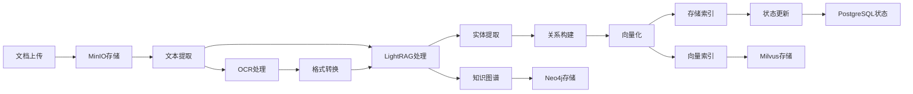

# 🎯 语析知识库系统深度架构分析

基于对系统核心代码的深度分析，我将为您呈现这个基于 LightRAG 的企业级知识库系统的完整技术架构。

```mermaid
graph TB
    %% 用户请求入口
    A[用户请求] --> B[FastAPI 应用]
    
    %% 中间件层
    subgraph MW["🔗 中间件层"]
        B --> C[CORS 中间件]
        C --> D[认证中间件<br/>JWT验证]
        D --> E[RBAC权限中间件]
    end
    
    %% 权限框架核心
    subgraph PF["🔐 权限框架层"]
        E --> F[PermissionEngine<br/>权限决策引擎]
        F --> G[策略链执行]
        
        %% 策略详细展示
        G --> H1[SuperAdmin策略<br/>优先级1]
        G --> H2[Ownership策略<br/>优先级2]
        G --> H3[PublicResource策略<br/>优先级3]
        G --> H4[SystemPermission策略<br/>优先级4]
        G --> H5[ResourcePermission策略<br/>优先级5]
        G --> H6[Inheritance策略<br/>优先级6]
        G --> H7[DenyAll策略<br/>优先级999]
        
        %% 缓存系统
        F --> CACHE[多级缓存系统]
        CACHE --> L1[L1内存缓存<br/>60s TTL]
        CACHE --> L2[L2 Redis缓存<br/>30min TTL]
    end
    
    %% API路由层
    subgraph API["🌐 API路由层"]
        E --> K[知识库路由]
        K --> L[知识库管理API]
        K --> M[文件管理API]
        K --> N[查询API]
        K --> O[权限管理API]
    end
    
    %% 业务逻辑层
    subgraph BL["⚙️ 业务逻辑层"]
        L --> P[KnowledgeBaseManager]
        P --> Q[LightRAGAdapter]
        Q --> R[LightRAG实例]
        
        %% 模型适配
        R --> AF[LightRAGModelAdapter]
        AF --> AG[统一模型配置]
        AG --> AH[LLM函数]
        AG --> AI[嵌入函数]
    end
    
    %% 数据访问层
    subgraph DA["🔌 数据访问层"]
        P --> S[UnifiedDatabaseManager]
        S --> T[ConnectionManager]
        T --> U[PostgreSQL适配器]
        T --> V[Neo4j适配器]
        T --> W[Redis适配器]
        T --> X[Milvus适配器]
        T --> Y[MinIO适配器]
        
        %% 存储适配
        R --> Z[LightRAGStorageAdapter]
        Z --> AA[存储配置]
        AA --> AB[Neo4j图存储]
        AA --> AC[Redis KV存储]
        AA --> AD[PostgreSQL文档状态]
        AA --> AE[Milvus向量存储]
    end
    
    %% 数据存储层
    subgraph DS["💾 数据存储层"]
        U --> AJ[(PostgreSQL<br/>用户数据/知识库元数据)]
        V --> AK[(Neo4j<br/>知识图谱)]
        W --> AL[(Redis<br/>缓存/会话)]
        X --> AM[(Milvus<br/>向量存储)]
        Y --> AN[(MinIO<br/>文件存储)]
    end
    
    %% 核心业务流程
    subgraph PROC["📋 核心业务流程"]
        direction LR
        
        %% 文档处理流程
        AO[文档上传] --> AP[文本提取]
        AP --> AQ[LightRAG处理]
        AQ --> AR[知识图谱构建]
        AR --> AS[向量化存储]
        AS --> AT[索引更新]
        
        %% 查询流程
        AU[用户查询] --> AV[权限验证]
        AV --> AW[LightRAG查询]
        AW --> AX[混合检索]
        AX --> AY[图谱查询]
        AX --> AZ[向量检索]
        AY --> BA[结果合并]
        AZ --> BA
        BA --> BB[答案生成]
    end
    
    %% 权限装饰器系统
    subgraph DEC["🎨 权限装饰器"]
        direction TB
        DEC1[@require_kb_permission]
        DEC2[@require_system_permission]
        DEC3[@require_any_permission]
        DEC4[@require_all_permissions]
        
        L -.-> DEC1
        O -.-> DEC2
        M -.-> DEC3
        N -.-> DEC4
    end
    
    %% 审计系统
    subgraph AUDIT["📝 审计系统"]
        F --> AUDIT1[权限检查日志]
        F --> AUDIT2[操作审计记录]
        F --> AUDIT3[安全事件监控]
    end
    
    %% 样式定义
    classDef middleware fill:#e3f2fd,stroke:#1976d2,stroke-width:2px
    classDef permission fill:#f3e5f5,stroke:#7b1fa2,stroke-width:2px
    classDef api fill:#e8f5e8,stroke:#388e3c,stroke-width:2px
    classDef business fill:#fff3e0,stroke:#f57c00,stroke-width:2px
    classDef data fill:#fce4ec,stroke:#c2185b,stroke-width:2px
    classDef storage fill:#f1f8e9,stroke:#689f38,stroke-width:2px
    classDef process fill:#e0f2f1,stroke:#00796b,stroke-width:2px
    classDef decorator fill:#f9fbe7,stroke:#827717,stroke-width:2px
    classDef audit fill:#fff8e1,stroke:#f9a825,stroke-width:2px
    classDef strategy fill:#faf0e6,stroke:#8d6e63,stroke-width:2px
    classDef cache fill:#e8eaf6,stroke:#3f51b5,stroke-width:2px
    
    %% 应用样式
    class MW,C,D,E middleware
    class PF,F,G,H1,H2,H3,H4,H5,H6,H7 permission
    class API,K,L,M,N,O api
    class BL,P,Q,R,AF,AG,AH,AI business
    class DA,S,T,U,V,W,X,Y,Z,AA,AB,AC,AD,AE data
    class DS,AJ,AK,AL,AM,AN storage
    class PROC,AO,AP,AQ,AR,AS,AT,AU,AV,AW,AX,AY,AZ,BA,BB process
    class DEC,DEC1,DEC2,DEC3,DEC4 decorator
    class AUDIT,AUDIT1,AUDIT2,AUDIT3 audit
    class CACHE,L1,L2 cache
```
## 🏗️ 一、系统架构概览


### 1.1 双架构融合设计

这个系统采用了**创新的双架构融合模式**：

**原生 LightRAG 架构**：
- 专注于 RAG 核心功能：文档处理、知识图谱构建、混合检索
- 使用原生的 GraphRAG 算法进行实体关系提取
- 保持 LightRAG 的高性能查询能力

**企业级统一架构**：
- 统一数据库管理系统（6 个数据库协同）
- 企业级权限控制框架
- 多租户隔离与资源管理

### 1.2 关键适配器模式

系统通过三个核心适配器实现两套架构的无缝桥接：

```python
# 1. LightRAGAdapter - 业务层桥接
class LightRAGAdapter:
    async def ensure_lightrag_sync(self, kb_id: str):
        """确保LightRAG同步 - 复用现有模式"""
        
    async def add_document_to_lightrag(self, kb_id: str, file_id: str, content: str):
        """添加文档到LightRAG - 复用现有处理机制"""
        
    async def query_lightrag(self, kb_id: str, query: str, **kwargs):
        """查询LightRAG - 复用现有查询机制"""
```

```python
# 2. LightRAGStorageAdapter - 存储层桥接
class LightRAGStorageAdapter:
    async def get_complete_storage_config(self, kb_id: str = None):
        """获取完整的LightRAG存储配置"""
        
    async def setup_lightrag_environment(self, kb_id: str = None):
        """设置LightRAG运行环境"""
```

```python
# 3. LightRAGModelAdapter - 模型层桥接
class LightRAGModelAdapter:
    def get_llm_func(self, llm_config: Dict[str, Any] = None):
        """获取LightRAG兼容的LLM函数"""
        
    def get_embedding_func(self, embed_config: Dict[str, Any] = None):
        """获取LightRAG兼容的Embedding函数"""
```

## 🔧 二、技术实现深度解析

### 2.1 统一数据库管理系统

系统采用**六数据库协同架构**，每个数据库都有明确的职责分工：

```python
# 数据库职责分工
databases = {
    'server_db': {
        'engine': 'PostgreSQL',
        'purpose': '用户数据、知识库元数据、权限管理',
        'tables': ['users', 'knowledge_databases', 'knowledge_files', 'permissions']
    },
    'lightrag_db': {
        'engine': 'PostgreSQL', 
        'purpose': 'LightRAG文档处理状态跟踪',
        'tables': ['document_status', 'processing_logs']
    },
    'neo4j': {
        'engine': 'Neo4j',
        'purpose': '知识图谱存储、实体关系管理',
        'features': ['图查询', '关系推理', '路径发现']
    },
    'milvus': {
        'engine': 'Milvus',
        'purpose': '向量存储、语义检索',
        'features': ['高维向量索引', '相似度查询', '批量检索']
    },
    'redis': {
        'engine': 'Redis',
        'purpose': '缓存、会话管理、KV存储',
        'features': ['权限缓存', '查询缓存', '实时状态']
    },
    'minio': {
        'engine': 'MinIO',
        'purpose': '文件存储、对象管理',
        'features': ['大文件存储', '版本控制', '分布式访问']
    }
}
```

### 2.2 连接管理与适配器模式

**连接管理器**提供统一的数据库访问接口：

```python
class DatabaseConnectionManager:
    async def initialize_database(self, db_name: str, db_type: DatabaseType):
        """初始化数据库连接"""
        
    async def get_adapter(self, db_name: str) -> DatabaseAdapter:
        """获取数据库适配器"""
        
    async def health_check_all(self) -> Dict[str, Any]:
        """检查所有数据库健康状态"""
```

**适配器模式**为每种数据库提供统一接口：

```python
# 适配器继承体系
class DatabaseAdapter(ABC):
    @abstractmethod
    async def connect(self) -> bool
    
    @abstractmethod
    async def health_check(self) -> Dict[str, Any]
    
    @abstractmethod
    async def get_session(self)

# 具体实现
class PostgreSQLAdapter(DatabaseAdapter): ...
class Neo4jAdapter(DatabaseAdapter): ...
class RedisAdapter(DatabaseAdapter): ...
class MilvusAdapter(DatabaseAdapter): ...
class MinIOAdapter(DatabaseAdapter): ...
```

### 2.3 权限框架 - 策略模式设计

系统采用**策略模式**实现灵活的权限控制：

```python
class PermissionEngine:
    def __init__(self):
        self.strategies: List[PermissionStrategy] = []
    
    def register_strategy(self, strategy: PermissionStrategy):
        """注册权限策略"""
        self.strategies.append(strategy)
        self.strategies.sort(key=lambda s: s.get_priority())
    
    async def check_permission(self, context: PermissionContext) -> PermissionResult:
        """依次执行权限策略"""
        for strategy in self.strategies:
            result = await strategy.check_permission(context)
            if result.allowed:
                return result
        return PermissionResult(False, "All strategies denied")
```

**权限策略优先级**：
1. `SuperAdminStrategy` - 超级管理员（优先级 1）
2. `OwnershipStrategy` - 资源所有者（优先级 2）
3. `PublicResourceStrategy` - 公开资源（优先级 3）
4. `SystemPermissionStrategy` - 系统权限（优先级 4）
5. `ResourcePermissionStrategy` - 资源权限（优先级 5）
6. `InheritanceStrategy` - 继承权限（优先级 6）
7. `DenyAllStrategy` - 拒绝所有（优先级 7）

## 🚀 三、业务流程分析

### 3.1 文档处理流程

**完整的文档处理管道**：



关键代码实现：

```python
async def _process_document_async(self, file_id: str, user_id: str):
    """异步处理文档"""
    try:
        # 1. 获取文件信息
        file_obj = await self.file_repo.get_by_id(file_id)
        
        # 2. 提取文本内容
        content = await self._extract_text_content(file_path, file_type, metadata)
        
        # 3. 添加到LightRAG
        await self.lightrag_adapter.add_document_to_lightrag(
            kb_id, file_id, content, filename, file_path
        )
        
        # 4. 更新状态
        await self.file_repo.update_processing_status(file_id, 'completed')
        
    except Exception as e:
        await self.file_repo.update_processing_status(file_id, 'failed')
```

### 3.2 查询机制 - 混合检索

系统实现了**LightRAG 的混合检索机制**：

```python
async def query_knowledge_base(self, kb_id: str, query: str, user_id: str):
    """混合检索查询"""
    # 1. 权限验证
    if not await self.permission_validator.validate_kb_access(user_id, kb_id, Permission.READ):
        raise PermissionError("无权访问此知识库")
    
    # 2. LightRAG查询
    result = await self.lightrag_adapter.query_lightrag(
        kb_id, query, 
        mode="hybrid",  # 混合模式
        only_need_context=False
    )
    
    # 3. 结果后处理
    return self._process_query_result(result)
```

**混合检索包含**：
- **向量检索**：基于语义相似度的文档检索
- **图谱检索**：基于知识图谱的实体关系查询
- **关键词检索**：基于 BM 25 的精确匹配
- **结果融合**：多路召回结果的智能合并

### 3.3 权限控制链路

**完整的权限验证流程**：

```python
@require_kb_permission(Permission.READ, "kb_id")
async def get_knowledge_base(kb_id: str, current_user: User):
    """API装饰器自动权限验证"""
    # 装饰器已完成权限验证
    return await kb_manager.get_knowledge_base(kb_id, user_id)

# 装饰器实现
def require_kb_permission(permission: Permission, kb_id_param: str):
    def decorator(func):
        async def wrapper(*args, **kwargs):
            # 1. 提取kb_id
            kb_id = kwargs.get(kb_id_param)
            
            # 2. 构建权限上下文
            context = PermissionContext(
                user_id=current_user.id,
                resource=KnowledgeBaseResource(kb_id),
                permission=permission
            )
            
            # 3. 权限检查
            result = await permission_engine.check_permission(context)
            if not result.allowed:
                raise HTTPException(403, result.reason)
            
            # 4. 执行原函数
            return await func(*args, **kwargs)
        return wrapper
    return decorator
```

## 🎨 四、关键设计思想

### 4.1 适配器模式的精妙运用

系统通过**三层适配器**实现架构融合：

1. **业务适配器**（LightRAGAdapter）：在 KnowledgeBaseManager 中桥接新旧业务逻辑
2. **存储适配器**（LightRAGStorageAdapter）：将统一数据库配置转换为 LightRAG 格式
3. **模型适配器**（LightRAGModelAdapter）：将项目模型配置转换为 LightRAG 函数

### 4.2 命名空间隔离策略

```python
# 知识库级别的命名空间隔离
rag = LightRAG(
    working_dir=working_dir,
    namespace_prefix=f"kb_{db_id}_",  # 关键：按知识库隔离
    # ... 其他配置
)
```

**隔离效果**：
- 每个知识库在向量数据库中有独立的集合
- 图数据库中的节点标签包含知识库前缀
- 完全避免了多知识库间的数据污染

### 4.3 多级配置降级机制

```python
def _get_model_config(self, model_type: str, kb_config: Dict = None):
    """多级配置降级"""
    # 1. 优先使用知识库级别配置
    if kb_config and self._validate_kb_config(kb_config):
        return self._convert_kb_config_to_model_info(kb_config)
    
    # 2. 使用系统默认配置
    return self._get_system_default_config(model_type)
    
    # 3. 降级到硬编码配置
    except Exception:
        return self._get_fallback_config(model_type)
```

## ⚡ 五、性能优化策略

### 5.1 多级缓存体系

**权限缓存**：
```python
# 权限结果缓存
if self.cache_manager:
    cached_result = await self.cache_manager.get_permission(context)
    if cached_result:
        return cached_result
```

**连接池管理**：
```python
class PostgreSQLAdapter:
    def __init__(self, config: Dict[str, Any]):
        self.engine = create_async_engine(
            connection_string,
            pool_size=config.get('pool_size', 10),
            max_overflow=config.get('max_overflow', 20),
            pool_pre_ping=True
        )
```

**异步处理**：
```python
# 文档处理异步化
await self.file_repo.update_processing_status(file_id, 'processing')
asyncio.create_task(self._process_document_async(file_id, user_id))
```

### 5.2 批量操作优化

```python
async def batch_check_permissions(self, user_id: str, permission_requests: List[tuple]):
    """批量权限检查"""
    results = []
    for resource, permission in permission_requests:
        allowed = await self.check_permission_simple(user_id, resource, permission)
        results.append(allowed)
    return results
```

### 5.3 健康监控机制

```python
async def start_health_monitoring(self, interval: int = 30):
    """启动健康监控"""
    async def monitor_loop():
        while self._health_check_enabled:
            health_results = await self.health_check_all()
            # 处理不健康的连接
            await self._handle_unhealthy_connections(health_results)
            await asyncio.sleep(interval)
    
    self._health_check_task = asyncio.create_task(monitor_loop())
```

## 🔮 六、扩展开发建议

### 6.1 水平扩展策略

**数据库分片**：
- 按知识库 ID 进行分片
- 使用一致性哈希算法
- 支持动态扩容

**服务拆分**：
- 文档处理服务独立部署
- 查询服务无状态化
- 权限服务集中化

### 6.2 功能扩展方向

**多模态支持**：
```python
class MultimodalProcessor:
    async def process_image(self, image_data: bytes):
        """图像理解与文本提取"""
        
    async def process_video(self, video_path: str):
        """视频内容分析"""
        
    async def process_audio(self, audio_data: bytes):
        """语音转文本"""
```

**实时协作**：
```python
class RealtimeCollaboration:
    async def broadcast_knowledge_update(self, kb_id: str, update: Dict):
        """实时知识更新推送"""
        
    async def handle_concurrent_editing(self, file_id: str, edits: List[Edit]):
        """并发编辑冲突解决"""
```

### 6.3 性能调优建议

**向量索引优化**：
- 使用 IVF_FLAT 索引用于高精度场景
- 使用 HNSW 索引用于高速检索场景
- 动态调整索引参数

**图查询优化**：
- 使用 Cypher 查询缓存
- 实现图数据分区
- 优化关系深度限制

**模型推理加速**：
- 实现模型预热机制
- 支持批量推理
- 集成模型量化技术

## 🎯 七、总结

这个基于 LightRAG 的企业级知识库系统展现了**卓越的架构设计思维**：

1. **双架构融合**：巧妙地将 LightRAG 的 RAG 能力与企业级管理需求结合
2. **适配器模式**：通过三层适配器实现系统间的无缝桥接
3. **策略模式**：权限框架的灵活性与扩展性
4. **多数据库协同**：每个数据库发挥最佳性能
5. **分层设计**：清晰的职责分离与模块化

该系统不仅保持了 LightRAG 的核心优势，还具备了**企业级的可扩展性、安全性和可维护性**，是 RAG 系统架构设计的典范之作。